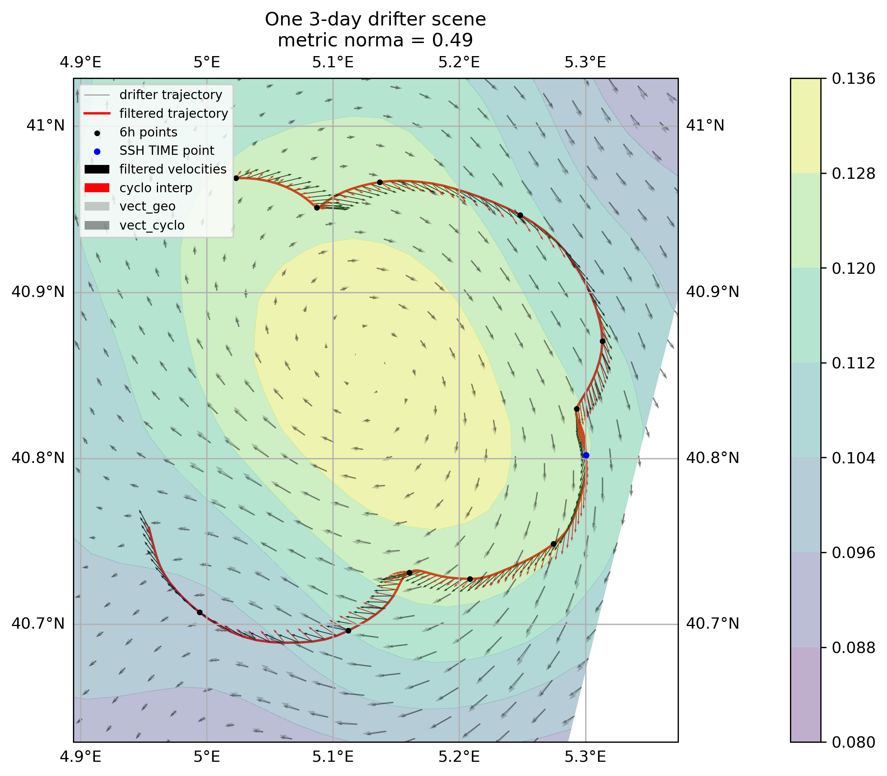

# MEOM_internship_2024

IGE - MEOM team internship (June-July 2024)

Leo Boux de Casson leo.boux_de_casson@ens-lyon.fr

Internship supervisors: Julien Le Sommer and Vadim Bertrand

**Eulerian comparison between lagrangian drifters velocities and sea surface currents reconstructed from the SWOT swath in the Mediterranean Sea**
---

---
- **Dataproducts** used:  

	- Mapped SSH field in the mediterranean sea

		- Mihost allnadirs SSH

		- Mihost allnadirs+swot SSH

  
	- SWOT swath SSH product
		- SWOT_L3_LR_SSH_Expert v0.3

  
	- SVP Drifters data from the BioSWOT-Med and C-SWOT-2023 missions
		- L2 processed data

- SSC are calculated thanks to the jaxparrow module https://github.com/meom-group/jaxparrow (Vadim Bertrand)

---
- Repo Structure:
	- `load_field_dataset.py` : load the field dataproduct in a standardize xarray dataset format
	- `Drifters_filters/` : notebooks with tests of several  filters, the final decision is to filter only the velocities with the scipy low_pass filter
		
		- wavelet filter for positions and velocities
		- gaussian filter for positions, best is gaussian_std = 7hours 
		- scipy low_pass filter, best is cutoff = 48h
	
	- `Field_processing_and_plots/` : 
		- notebooks to see the spatial/temporal field filtering and to have plots and animations of the geostrophic/cyclogeostrophic obtained thanks to jaxparrow
		- the best filter is gaussian_std = 3.5km 

	-  `L4_eulerian_comparison/` : notebooks with the eulerian comparison of drifters velocities and Mihost fields to see the amelioration of adding swot data in the Mihost mapped SSH
	- `L3_eulerian_comparison/` :
		
		- 	 `MAIN_save_filtered_field_and_Generate_scenes.py` : file to generate a "scenes dataset" with a given field and drifters filtering. Scenes are 3-days long drifters/field comparison to see what is happening at small scales (~10km)
		- notebooks to see some GOOD and BAD scenes, based on the metric $\frac{||U_{field} - U_{drifter}||}{||U_{drifter}||}$ and also sea the overall eulerian comparison results in the swath

    - `save_data/` : 
	
		- input data are in `fields_data/` and `drifters/`
		- Best filtering Scenes data are in `drifters_scenes/`
    
	- `save_plots/` : Results plots, with movies of the SWOT swath (SSH, Vorticity...), filtering PSD plots and the 20 best and 20 worst scenes in `L3_Scenes/L3_Scenes_GOODBAD_best_filtering`

